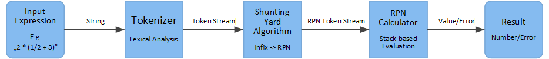

# ShuntingYardRPN

This Project contains two implementations of the **Shunting Yard algorithm** and a **Reverse Polish Notation (RPN) calculator**, one written in Elixir and one written in Go applying functional style.

The project demonstrates a clean separation between lexical analysis (tokenization), syntactic transformation (Shunting Yard), and expression evaluation (RPN).
It is intended as a learning project and as a comparison example for functional programming concepts.

---

## Overview

The program processes arithmetic expressions using a linear pipeline architecture:



Each stage is implemented as a separate component, separating responsibilities and allowing independent testing in both the Go and Elixir implementations.

---

## How to run
### Elixir
In the 'Elixir' directory:
```
mix run -e 'CLI.main()' "EXPRESSION"
```

Example:
```
mix run -e "CLI.main()" "2 * (0-3) + 1/2"
```
Note: This does not seem to work on powershell due to incorrect argument parsing, please use any other shell.

Run tests:
```
mix test
```
### Go
In the 'Go' directory:
```
go run . "EXPRESSION"
```
Example:
```
go run . "2 * (0-3) + 1/2"
```
Run tests:
```
go test -v ./...
```
---
## Features

* Supports floating-point arithmetic
* Supports the binary operators `+`, `-`, `*`, `/`
* Supports parentheses `(` and `)`
* Syntax validation
* Clear error reporting

---

## Unary Minus Limitation

The unary minus operator is not supported.

**Valid example**

```
2 * (0 - 3) = -6
```

**Invalid example**

```
2 * -3
```

Unary minus is treated as a **syntax error** and must be expressed using a binary operation instead.

---

## Shunting Yard Algorithm – Description

The **Shunting Yard algorithm**, developed by **Edsger Dijkstra**, converts mathematical expressions from **infix notation**
(e.g. `2 * (3 + 4)`) into **Reverse Polish Notation (RPN)**.

RPN removes the need for parentheses and allows expressions to be evaluated efficiently using a simple stack.

The algorithm processes the input **from left to right** and uses two main data structures:

* an **output queue** (for the resulting RPN expression)
* an **operator stack** (for temporarily storing operators and parentheses)

---

## Input Tokens

The algorithm operates on a token stream produced by a tokenizer.
Supported token types are:

* Numbers: `{:num, value}`
* Binary operators: `{:op, +}`, `{:op, -}`, `{:op, *}`, `{:op, /}`
* Left parenthesis: `(`
* Right parenthesis: `)`

---

## Shunting Yard Algorithm Rules

### 1. Numbers

* Numbers are **immediately appended to the output queue**.
* They do not interact with the operator stack.

### 2. Operators

When an operator `op1` is read:

* While there is an operator `op2` at the top of the operator stack such that:

  * `op2` has **greater or equal precedence** than `op1`, and
  * `op2` is **not a left parenthesis**

  → `op2` is popped from the stack and appended to the output queue.

* After that, `op1` is pushed onto the operator stack.

All operators are **left-associative**.

### 3. Left Parenthesis `(`

* A left parenthesis is **always pushed onto the operator stack**.
* It temporarily disables precedence comparison.

### 4. Right Parenthesis `)`

* Operators are popped from the stack and appended to the output queue
  **until a matching left parenthesis is found**.
* The left parenthesis is removed but **not added to the output**.
* If no matching left parenthesis exists, a **syntax error** is reported.

### 5. End of Input

* After all tokens have been processed, **all remaining operators**
  are popped from the operator stack and appended to the output queue.
* If any parentheses remain on the stack, a **syntax error** is reported.

---

## Syntax Validation

This implementation enforces additional syntactic constraints:

* All operators are **binary only**
* An operator may appear **only after**

  * a number, or
  * a right parenthesis
* Operators are **not allowed**

  * at the beginning of the expression
  * directly after another operator
  * directly after a left parenthesis

Again, unary minus (e.g. `-3`) is not supported and is treated as a syntax error.

---

## Result

The output of the Shunting Yard algorithm is a sequence of tokens in
**Reverse Polish Notation (RPN)**.

**Example**

```
Infix:  2 * (0 - 3) + 1 / 2
RPN:    2 0 3 - * 1 2 / +
```

This RPN representation is then evaluated using a simple stack-based calculator.

---

## Summary

This project demonstrates how the same functional ideas can be expressed differently in Elixir and Go, depending on the language’s design and idioms.

The Elixir implementation follows a canonical functional programming style. All data structures are immutable, control flow is expressed through pattern matching, and iteration over token streams is implemented using Enum.reduce/3. Errors are represented explicitly as values ({:ok, value} / {:error, reason}), and pipelines (|>) are used to express function composition in a declarative way. State transitions, such as the output queue and operator stack in the Shunting Yard algorithm, are represented explicitly as values passed from one step to the next, without mutation.

The Go implementation follows a functional design at the architectural level while using imperative constructs internally. Each processing stage is implemented as a pure function with explicit parameters and return values, and no global mutable state is used in the core logic. State, such as stacks, is mutated locally, and errors are propagated explicitly using Go’s conventional (value, error) return style. Iteration is expressed using for loops or a custom Reduce higher-order function.

Although Go does not enforce immutability, the implementation preserves functional properties by ensuring that all state changes are local to a function, no function has hidden side effects (i.e. core functions remain pure), and the data flow between processing stages remains explicit.

Overall, the comparison shows that functional programming is primarily about design principles rather than syntax alone. Elixir provides direct language support for functional concepts, while Go as a multi-paradigm language requires more discipline but can still express the same ideas in a clear and idiomatic way.
